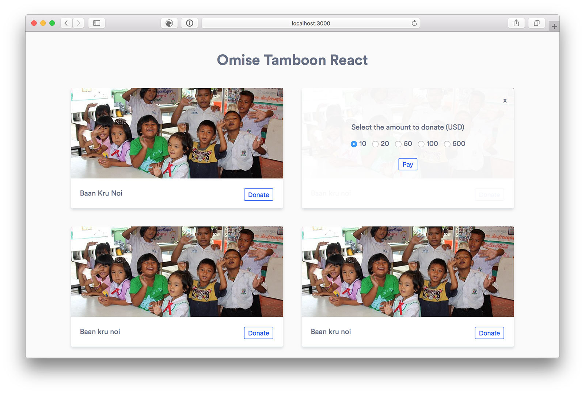

## Mission

- [x] Complete the application according to the design (image above).
- [x] Complete these features that are not in the design (you have freedom to design and position to display).
  - Display all donation amount.
  - Display a message when paid.
- [x] Make the donation feature works correctly.
  - Amount in all donations should be displayed correctly despite users close and come back later.
  - Database (db.json) should have the new valid data when paid.
- [x] Production quality code is expected
- [x] Unit tests is a must
- [x] Refactor the code to be more readable and enhance reusability.
- [x] Use only [styled-component](https://www.styled-components.com/) for styling part.
- [x] Display well in most modern browser (Google Chrome, Safari, Firefox).
- [x] Supporting different screen sizes (responsive).
- [x] Write unit tests with [jest](https://facebook.github.io/jest/).
- [x] Improve the design to have better UI and UX.

## Online version

Sever and client are separately deployed to two popular hosting services.

- Client: https://omise.now.sh/
- Server: https://omise.herokuapp.com/

## Notes

- Using USD as the only currency of the application

## Limitations

- Webpack is configed at a very basic level
- Not 100% percent of code was coveraged by test
- Not handle lazy loading images
- Paging
- No code spliting
